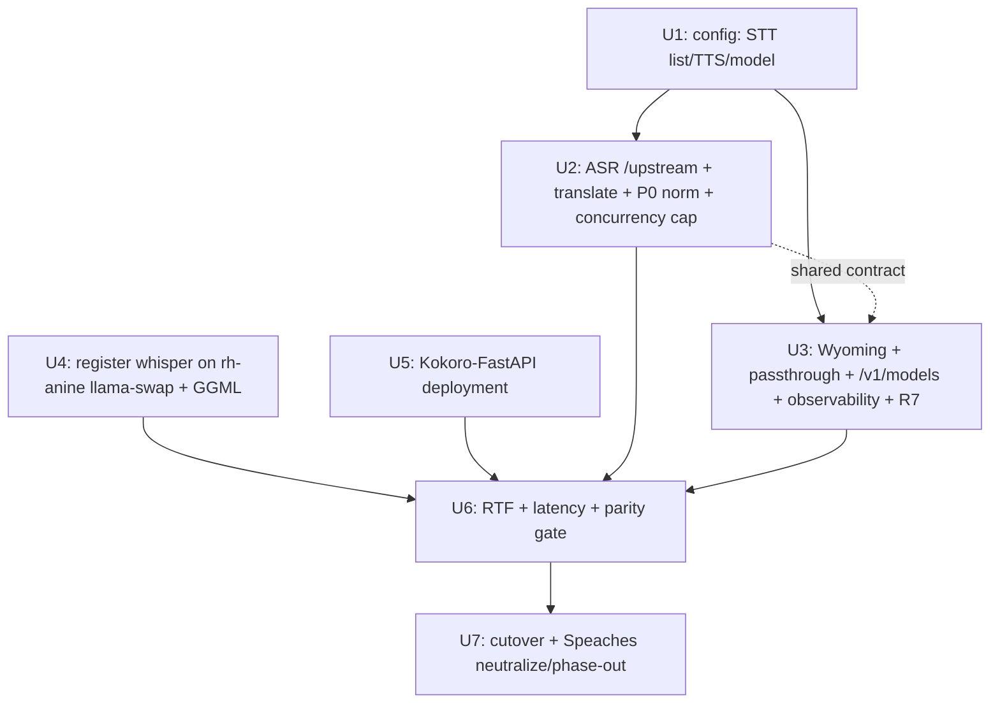

# feat: Move speech STT/TTS off Speaches onto llama-swap (whisper.cpp) + Kokoro-FastAPI

## Overview

speech-router's STT 500s in production: its in-pod Speaches CUDA sidecar OOMs loading
Whisper because hr-main's RTX 3080 (10 GiB) is GPU-time-sliced ×12 with no VRAM
isolation, so Speaches and `llama-swap-cuda` contend for the same memory.

**This plan (Workstream 1) drops Speaches and re-homes audio. v1 ships on the
Strix-Halo node only, which has the headroom and needs no new image; the CUDA node is a
deferred, data-gated fast-follow:**
- **STT (v1)** = whisper.cpp `whisper-server` registered as a **llama-swap model on
  rh-anine** (Vulkan; the `unified-vulkan` image already ships `whisper-server`;
  96 GiB GTT). speech-router routes to it via `/upstream/<model>/v1/audio/...`.
- **TTS** = a standalone **Kokoro-FastAPI** Deployment (keeps the Kokoro voices).
- **speech-router** stays the audio front door, routing **direct to llama-swap**
  (not via ollama-router), with config shaped as an ordered upstream list for
  forward-compat.
- **Speaches is phased out** (idle-then-remove): STT/TTS traffic moves off it now
  (fixing the 500s); the sidecar's GPU/route are neutralized so it can't re-OOM; the
  sidecar/UI are fully removed after Workstream 2 (Open WebUI audio config) ships.
- **Deferred fast-follow:** a custom CUDA `whisper-server` image + registering whisper
  on `llama-swap-cuda` + ordered failover — **only if** the Unit 6 RTF/latency data
  shows the CUDA node is wanted. (See "Fast-Follow".)

**Why Strix-first:** R1 (stop the OOM) is fully met by rh-anine alone — it's a different
node from the contended card, with abundant VRAM. Putting whisper onto the 10 GiB CUDA
card under llama-swap's matrix would trade the OOM for chat-model eviction/swap-thrash
and add a build/maintenance burden on the very node we're relieving. So we sequence the
"leverage both nodes" intent rather than front-load it.

## Problem Frame

Production STT (`/asr`, OpenAI `/v1/audio/transcriptions`, Wyoming STT) returns 500
because Speaches raises `RuntimeError: CUDA failed with error out of memory` at model
load. Root cause is structural VRAM oversubscription. `faster-whisper`/CTranslate2 is
CUDA/CPU-only, so the AMD/Vulkan path requires whisper.cpp. The fix is to make STT a
llama-swap-managed workload on a node with headroom and remove the contending Speaches
allocator from the hot card.

## Terminology

- **Whisper** — the speech-to-text model family.
- **whisper.cpp** — the C++ inference engine; ships `whisper-server` (HTTP).
- **whisper-server** — the binary speech-router targets (present in the rh-anine
  `unified-vulkan` image).
- **whisper** (lowercase) — the llama-swap model id / alias used in `/upstream/<id>`.

## Requirements Trace

- **R1.** STT stops OOMing — Whisper runs under llama-swap on rh-anine (headroom),
  never as an independent allocator on the contended CUDA card.
- **R2.** All STT entry paths keep working: Bazarr `/asr` (transcribe + translate +
  multi-chunk language detect — with correct ISO language), OpenAI
  `/v1/audio/transcriptions`, Wyoming STT.
- **R3.** TTS (OpenAI `/v1/audio/speech` + Wyoming synthesize) works against
  Kokoro-FastAPI, preserving Kokoro voices and the exact PCM format Wyoming expects.
- **R4.** speech-router's STT upstream config is an **ordered list** (forward-compat for
  the CUDA fast-follow), with single-entry behavior in v1.
- **R5.** Speaches is removed from the audio data path; its GPU/route are neutralized at
  cutover; the sidecar is fully removed after WS2, on a stated deadline.
- **R6.** STT throughput **and cold-swap tail latency vs. caller timeouts** are measured
  and judged acceptable before cutover.
- **R7.** speech-router tolerates Open WebUI's extra request fields (e.g. `chat_id`) on
  `/v1/audio/*` rather than 400-ing (origin: WS2 R7).

## Scope Boundaries

- **Non-goal (deferred to fast-follow):** the custom CUDA image, registering whisper on
  `llama-swap-cuda`, and active failover logic — gated on Unit 6 data.
- **Non-goal:** routing audio through ollama-router (direct to llama-swap via
  `/upstream/<model>`).
- **Non-goal:** building the replacement Web UI — Workstream 2 (reuse Open WebUI).
- **Non-goal:** OuteTTS / llama.cpp-native TTS — TTS stays Kokoro.
- **Non-goal:** per-model authz on llama-swap — speech-router is accepted as a trusted
  client (see Risks).

## Context & Research

### Relevant Code and Patterns

- `src/config.rs` — `Config::from_env`; single `speaches_url`. Becomes an ordered STT
  upstream list, a TTS upstream, and the whisper model id for `/upstream/<model>`.
- `src/asr.rs` — `/asr` pipeline; `AsrTask::endpoint()` (`asr.rs:67`) maps Translate →
  `/v1/audio/translations`; `detect_language_from_file` (`asr.rs:633`) fans out
  `DETECT_NUM_SAMPLES=13` concurrent `detect_language_single` calls; `detect_language_single`
  (`asr.rs:713`) reads top-level `language` and omits `language` for auto-detect.
  `isolang` is already used (`asr.rs:94-147`) — but only `from_639_1`/`to_639_3`/`to_name`.
- `src/wyoming.rs` — `finish_stt` (empty-transcript fallback on error, `wyoming.rs:513`),
  `handle_tts` (posts `pcm` + `sample_rate=24000`, frames audio as 24k/16-bit/mono),
  `info_event` voice list (`wyoming.rs:182`).
- `src/main.rs` — `passthrough_route` forwards non-`/asr` to `speaches_url`;
  `health_route` probes `{speaches_url}/v1/models`; reqwest client built with **no
  timeout** (`main.rs:59-64`).
- `src/metrics.rs` — request counters.
- hr-fleet `fleet/ai/llama-swap.yaml` (Vulkan, rh-anine) — ConfigMap `models:`/`matrix:`;
  image ships `whisper-server`; NetworkPolicy ingress = `app=ollama-router` only;
  `healthCheckTimeout: 360`; models on hostPath `/var/db/llama-server`.
- hr-fleet `fleet/ai/speech-router.yaml` — Speaches sidecar (`nvidia.com/gpu: 1`,
  `speaches.hr-home.xyz` IngressRoute with OIDC); cutover/phase-out target.
- hr-fleet `fleet/ai/kustomization.yaml`; `containers/llama-server-turboquant` (build precedent).

### Institutional Learnings

- Spike: llama-swap routes `/v1/audio/transcriptions` (multipart `model` via
  `FormValue`) and exposes `/upstream/<model>/<path>` (selects model by URL, version-
  proof). `cmd` can be any server; readiness = 200 on `checkEndpoint` (or `none`).
- whisper.cpp `verbose_json` returns the language as a **name**, typically **lowercase**
  ("english") — not the ISO code; `--translate` is English-only; cold-load 5–11 s.
- gfx1151: Vulkan ≫ ROCm for llama.cpp; rh-anine has 96 GiB GTT.

### External References

- ggml-org/whisper.cpp `examples/server`; mostlygeek/llama-swap (`/upstream`, `cmd`,
  `checkEndpoint`); remsky/Kokoro-FastAPI (`/v1/audio/speech`, Kokoro voices, key
  `not-needed`).

## Key Technical Decisions

| Decision | Rationale |
|---|---|
| **v1: STT on rh-anine/Vulkan only** | R1 met with no new image; the CUDA card is the one we're relieving. CUDA node deferred to a data-gated fast-follow. |
| TTS = standalone Kokoro-FastAPI | Neither llama-swap image ships a Kokoro/TTS binary; OuteTTS would degrade voices. |
| speech-router → llama-swap direct via `/upstream/<model>` | Version-proof, selects model by URL; keeps ollama-router LLM-only. |
| STT config = ordered list, single-entry in v1 | Forward-compat for the fast-follow without shipping failover machinery now. |
| Translate via `translate=true`; `language=auto`; **P0 name→ISO normalization** | whisper-server has no translations route, defaults to `en`, and returns a (lowercase) language **name** the `/asr` pipeline can't consume as a code. |
| Detection **concurrency cap + request timeout + quorum** as code deliverables | 13-way fan-out serializes on one whisper-server; uncapped + no timeout → stalls/silent mis-detection. Not Unit-6 tuning. |
| Synthesize `/v1/models` locally; `health_route` stops probing Speaches | After Speaches, nothing answers `/v1/models`; OpenAI-audio clients (WS2) and readiness must not depend on it. |
| Accept speech-router as a trusted llama-swap client | Homelab posture; documented in Risks (it gains the full llama-swap surface). |
| Total-outage UX = empty transcript + **alerting** metric | Preserve HA UX; make outages operationally visible via a thresholded alert. |
| Phase-out neutralizes Speaches' GPU/route with a deadline | Leaving a Whisper-capable sidecar reachable would let the OOM re-trigger; don't leave it armed. |

## Open Questions

### Resolved During Planning

- Standalone vs llama-swap STT → llama-swap (matrix/placement), **rh-anine first**.
- Both nodes now? → **No** — Strix-first; CUDA is a gated fast-follow.
- Multipart routing → `/upstream/<model>`. TTS home → Kokoro-FastAPI. Routing layer →
  direct (not ollama-router). Speaches removal → phased, GPU/route neutralized.
- llama-swap authz → accept speech-router as trusted. Outage UX → empty + alert.

### Deferred to Implementation

- **Confirm whisper-server's `verbose_json` language value format** (casing/spelling)
  on the deployed build — a **prerequisite spike for Unit 2** (its P0 normalization
  depends on it), not a post-hoc Unit 6 check.
- **whisper-server `checkEndpoint`** — which served path returns 200 only when ready, or
  `none` + a startup preload so the first request isn't cold (Unit 4).
- **Exact whisper GGML artifact + SHA256** + the verification mechanism (Unit 4).
- **`/v1/models` shape** — minimal synthesized list (whisper + kokoro ids); confirm
  against the pinned Open WebUI tag whether its audio engine calls it (WS2 research gate).
- **Caller timeout values** (HA Wyoming assist, Bazarr `/asr`, Open WebUI Call) — gather
  for the Unit 6 acceptance thresholds.

## High-Level Technical Design

> *Directional guidance for review, not implementation specification.*

```
                ┌──────── speech-router (hr-main; Speaches neutralized, not in data path) ────────┐
 Bazarr /asr ──▶│ asr.rs: transcribe/translate/detect (translate=true, language=auto, name→ISO,   │
 OpenAI /v1/audio/transcriptions ─▶ passthrough (path→STT) │  concurrency-capped + timeout + quorum)│
 Wyoming STT (finish_stt) ─────────────────────────────────┼──▶ STT_UPSTREAMS[0]  (v1: single)      │
 OpenAI /v1/audio/speech ─▶ passthrough (path→TTS) ─┐       │                                        │
 Wyoming TTS (handle_tts) ───────────────────────────┼──────┼──▶ TTS_URL                              │
 /v1/models (synthesized locally), /detect-language ─┘ (STT path)                                     │
                └───────────────────────────────────────────┼────────────────────────────────────────┘
                                                             ▼
   STT_UPSTREAMS = [ http://llama-swap.ai:8080/upstream/<whisper> ]   (rh-anine, Vulkan, 96GB GTT)
   TTS_URL       =   http://kokoro-fastapi.ai:8080                     (Kokoro-FastAPI)
   ── fast-follow: prepend http://llama-swap-cuda.ai:8080/upstream/<whisper> + failover ──
```

## Implementation Units



- [x] **Unit 1: speech-router config — STT upstream list, TTS upstream, model id**

**Goal:** Replace `speaches_url` with an ordered STT upstream list (single entry in v1),
a TTS upstream, and the whisper model id used in `/upstream/<model>`.

**Requirements:** R3, R4

**Dependencies:** None

**Files:** Modify `src/config.rs`; Test `src/config.rs`.

**Approach:** `stt_upstreams: Vec<String>` from `STT_URLS` (comma-sep, ordered, trimmed —
each a llama-swap base, e.g. `http://llama-swap.ai:8080`); `tts_url` from `TTS_URL`;
`stt_model` from `STT_MODEL` (the `/upstream/<id>` segment). **If neither `STT_URLS` nor
a legacy `SPEACHES_URL` fallback is set, error at startup** with a clear message — never
silently default.

**Test scenarios:**
- Happy: `STT_URLS="a"` → `[a]`; `TTS_URL`, `STT_MODEL` parsed; trailing slashes trimmed.
- Edge: `STT_URLS="a,b"` → ordered `[a,b]` (forward-compat); empty entries ignored.
- Error: neither `STT_URLS` nor `SPEACHES_URL` set → startup error.

**Verification:** config tests pass; list/TTS/model resolve; missing-config errors loudly.

- [x] **Unit 2: ASR pipeline — `/upstream` routing, translate, P0 language normalization, capped detection**

**Goal:** Target whisper-server via `/upstream/<model>`, fold translate into
`translate=true`, send `language=auto`, **normalize the language name → ISO code**, and
**bound the detection fan-out** with a concurrency cap, per-request timeout, and quorum.

**Requirements:** R1, R2

**Dependencies:** Unit 1. **Prerequisite spike:** confirm the live `verbose_json`
language value format before coding the normalization.

**Files:** Modify `src/asr.rs`, `src/main.rs` (`AsrState` + reqwest client timeout); Test `src/asr.rs`.

**Approach:**
- URLs = `{stt_upstreams[0]}/upstream/{stt_model}/v1/audio/transcriptions`; Translate
  adds a `translate=true` form part (drop `/v1/audio/translations`). Note `--translate`
  is **English-only** — document as a limitation; a non-English target isn't supported.
- `detect_language_single` sends `language=auto`.
- **P0 name→ISO:** whisper.cpp returns a language **name**, typically **lowercase**
  ("english"); `isolang` lookup is case-sensitive and the code currently only uses
  `from_639_1`. Add a name→code step (normalize casing to isolang's expected form, e.g.
  title-case, plus a small explicit map for whisper.cpp's known outputs) returning the
  2-letter code before `decide_task`/`find_track_by_language`/`language_name`. On an
  unmappable name, log a warning and treat detection as failed for that chunk (don't
  feed a bogus value downstream).
- **Detection bounds (code deliverable, not tuning):** wrap the 13-way fan-out
  (`asr.rs:660`) in a `Semaphore` (default cap 2–4, matching whisper-server's single
  mutex); set a per-request reqwest **timeout** generous enough to absorb one cold swap
  (≥15–20 s); require a **minimum quorum** of successful chunks before trusting the
  majority vote — below quorum, fail loudly/retry rather than silently defaulting.
- v1 is single-upstream; failover iteration is deferred to the fast-follow. (Keep body
  construction such that a retry could rebuild the multipart Form + reopen the temp
  file — see fast-follow.)

**Test scenarios:**
- Happy: transcribe posts to `/upstream/<model>/v1/audio/transcriptions`.
- Happy: translate adds `translate=true` to that path (no `/translations`), yields English.
- Happy: detection sends `language=auto`.
- **P0:** `{"language":"english"}` → `"en"`, `{"language":"german"}` → `"de"`; unknown name → chunk treated as failed (not defaulted).
- Detection bound: fan-out respects the semaphore cap; a slow upstream trips the per-request timeout; below-quorum detection fails rather than returning a default language.
- Edge: existing `decide_task`/`map_output_format`/`find_track_by_language` tests still pass.

**Verification:** asr tests pass; no `/v1/audio/translations`; `/upstream` paths; capped+timed+quorum detection; name→code confirmed against a live response.

- [x] **Unit 3: Wyoming, passthrough, `/v1/models`, observability, tolerate extra fields**

**Goal:** Route Wyoming STT/TTS and OpenAI passthrough; synthesize `/v1/models`; fix
health; alert on outages; tolerate unknown fields (R7).

**Requirements:** R2, R3, R7

**Dependencies:** Unit 1 (shares Unit 2's `/upstream` contract)

**Files:** Modify `src/wyoming.rs`, `src/main.rs`, `src/metrics.rs`; Test those.

**Approach:**
- `finish_stt` → STT upstream; `handle_tts` → `tts_url`; update `info_event` STT label
  to "whisper.cpp large-v3-turbo".
- `passthrough_route`: `/v1/audio/transcriptions` → STT; `/v1/audio/speech` → TTS;
  **`/v1/models` → a locally-synthesized minimal list** (the whisper + kokoro ids) so
  OpenAI-audio clients validate without a Speaches backend. **`/v1/audio/translations`
  → `501`** with a message pointing to `/asr` — the byte-passthrough can't inject
  whisper-server's `translate=true` form field, and failing loud beats silently
  returning a transcription. (Audio translation works via `/asr`'s translate task; full
  OpenAI-passthrough translation via buffered multipart rewrite is a deferred enhancement
  — no consumer needs it in this deployment.)
- **R7:** ensure passthrough/TTS forwarding ignores unknown JSON fields (e.g. `chat_id`)
  rather than 400-ing.
- **Observability:** `health_route` must stop probing `{speaches_url}/v1/models` — probe
  a **cheap** signal that doesn't trigger a model load (llama-swap's model list / its
  root, or speech-router liveness). Add an empty-transcript-fallback **counter**, wired
  to an **alert with a threshold** (the outage signal; HA UX unchanged).
- Clarify (doc): audio-chat's LLM leg is ollama-router (via the UI), not speech-router;
  speech-router only proxies `/v1/audio/*`.

**Test scenarios:**
- Happy: `upstream_for_path` maps transcriptions/translations → STT, speech → TTS; `/v1/models` → synthesized list.
- Happy: `finish_stt` → STT; `handle_tts` → TTS; `info_event` label updated.
- R7: a request with an extra `chat_id` is forwarded, not rejected.
- Error: STT failure increments the fallback counter (alert-backed) and still returns the empty transcript.
- Health: `health_route` reports unhealthy on STT-signal failure and **does not** depend on Speaches.

**Verification:** wyoming/metrics/passthrough tests pass; `/v1/models` synthesized; health independent of Speaches; no audio path hardcodes the old url.

- [x] **Unit 4: Register whisper-server in the rh-anine (Vulkan) llama-swap + provision GGML**

**Goal:** Add a `whisper` model to the rh-anine llama-swap ConfigMap (existing image) and
provision the GGML model; admit speech-router.

**Requirements:** R1

**Dependencies:** None

**Files:** Modify hr-fleet `fleet/ai/llama-swap.yaml` (ConfigMap model entry + NetworkPolicy).

**Approach:**
- Model entry, e.g.:
  ```yaml
  whisper-large-v3-turbo:
    aliases: [whisper]
    cmd: whisper-server -m /models/ggml-large-v3-turbo.bin --host 0.0.0.0 --port ${PORT}
         --inference-path /v1/audio/transcriptions --language auto
    checkEndpoint: <decide>   # whisper-server has no /health: a served 200 path, or "none" + startup preload
  ```
- 96 GiB GTT → trivial residency (no matrix contention).
- Provision the GGML model **SHA256-verified** onto `/var/db/llama-server` (pin URL +
  hash; verify before whisper-server starts — e.g. an init/provisioning check that fails
  closed). State who may write the hostPath.
- **NetworkPolicy:** add `from: podSelector app=speech-router` to the ingress allowlist.
  Accepted: this grants speech-router the **full** llama-swap surface (admin UI + all
  models) — recorded in Risks. Verify reachability from a speech-router-labelled pod
  with the policy applied (and that the cluster-network source IP, not the macvlan IP,
  is what the policy matches).

**Execution note:** manifest/config + ops unit.

**Test scenarios:** Test expectation: none (declarative). Validation = `kustomize build`
renders; `/upstream/whisper/v1/audio/transcriptions` reachable from a speech-router pod;
GGML hash verified.

**Verification:** rh-anine serves `whisper` via `/upstream/whisper`; model ready per
`checkEndpoint`; NetworkPolicy admits speech-router (confirmed live).

- [x] **Unit 5: Kokoro-FastAPI standalone Deployment**

**Goal:** Deploy Kokoro-FastAPI as the TTS backend, byte-compatible with Wyoming TTS.

**Requirements:** R3

**Dependencies:** None

**Files:** Create hr-fleet `fleet/ai/kokoro-tts.yaml` (Deployment + Service + **NetworkPolicy**); add to `kustomization.yaml`.

**Approach:**
- `ghcr.io/remsky/kokoro-fastapi-cpu` (CPU; reliable, >realtime). Service `kokoro-fastapi`.
- **NetworkPolicy is non-optional:** restrict ingress to speech-router (mirror the
  llama-swap pattern). Placeholder API key `not-needed` (documented).
- **Verify exact bytes:** `response_format=pcm` returns raw headerless **s16le mono at
  24000 Hz** (what `handle_tts` frames unconditionally); if Kokoro ignores the
  non-standard `sample_rate` field and returns a different rate, add resampling or set
  the Wyoming `audio-start` rate to the actual rate. Verify the `af_*/am_*/bf_*/bm_*`
  voice ids in `wyoming.rs:182` all exist.

**Execution note:** manifest unit.

**Test scenarios:** Test expectation: none (declarative). Validation = `/v1/audio/speech`
returns s16le/24k/mono PCM for a listed voice; NetworkPolicy admits only speech-router.

**Verification:** Kokoro reachable; PCM format + voices match Wyoming TTS expectations.

- [x] **Unit 6: RTF + cold-swap latency + parity validation gate**

**Goal:** Confirm STT throughput, cold-swap tail latency vs. caller timeouts, and
correctness on rh-anine before cutover.

**Requirements:** R6, R2

**Dependencies:** Units 2, 3, 4, 5

**Approach / acceptance gate (all must hold; record results):**
- Single-chunk RTF ≤ 1.0 on rh-anine; 1.0–1.5 acceptable only with the Unit 2
  concurrency cap = N and timeout = T documented; >1.5 escalate, do not cut over.
- **Cold-swap p99 vs caller timeouts:** enumerate HA Wyoming assist, Bazarr `/asr`, and
  Open WebUI Call timeouts; measure cold/first-request latency under **interleaved
  STT+chat** load (not just warm RTF); confirm within each caller's tolerance. If not,
  warm/pin whisper at startup.
- **End-to-end `/asr` detect+transcribe** under concurrent load with the Unit 2 cap;
  detection accuracy on a **non-English** sample (confirms the P0 name→ISO round-trips).
- `translate=true` (± source hint) yields English; `srt`/`vtt` well-formed.
- TTS parity: Kokoro voices + s16le/24k/mono PCM (Unit 5).

**Execution note:** validation/measurement gate.

**Test scenarios:** Test expectation: none (operational). Acceptance = the gate above.

**Verification:** documented RTF, cold-swap p99 vs each caller timeout, confirmed
language format, chosen cap/timeout, go/no-go recorded.

- [x] **Unit 7: Cutover + Speaches neutralize/phase-out**

**Goal:** Ship the patched speech-router, point it at the new backends, and **neutralize**
Speaches so it can't re-OOM, on a stated removal deadline.

**Requirements:** R1, R5

**Dependencies:** Unit 6

**Files:** Modify `Cargo.toml` (version bump); modify hr-fleet `fleet/ai/speech-router.yaml`
(image tag; add `STT_URLS`, `TTS_URL`, `STT_MODEL`); CI `release.yml`.

**Approach:**
- Ship image + flip env together (the image changes the request contract; don't ship-
  first against Speaches).
- **Neutralize Speaches at cutover** (don't just unpreload Whisper): remove the Speaches
  sidecar's `nvidia.com/gpu` and/or take down the `speaches.hr-home.xyz` IngressRoute so
  the deprecated UI cannot allocate VRAM and re-trigger the OOM. Keep the sidecar process
  only if a rollback path is wanted — but note rollback re-introduces the OOM and is a
  **last resort**.
- **Stated deadline/owner** for full Speaches removal (sidecar + IngressRoute + env),
  gated on WS2 go-live — not an open-ended window.

**Execution note:** rollout/ops unit; gated on Unit 6.

**Test scenarios:** Test expectation: none beyond Units 1–3 unit tests; validation observational.

**Verification:**
- STT smoke: Bazarr `/asr` (transcribe + translate + detect → correct ISO language),
  OpenAI `/v1/audio/transcriptions`, Wyoming STT — all 200, sensible transcripts, served by rh-anine.
- No `CUDA failed with error out of memory`; Speaches can no longer allocate GPU.
- TTS smoke: OpenAI `/v1/audio/speech` + Wyoming synthesize return Kokoro audio.
- `health_route` reflects STT health independent of Speaches; empty-transcript alert wired.
- Full Speaches removal tracked as a dated follow-up gated on WS2.

## Fast-Follow (Deferred — gated on Unit 6 data): CUDA-node STT + failover

Pursue **only if** Unit 6 shows the CUDA node is wanted (latency) or single-node STT
availability is insufficient. Scope:
- **Custom CUDA image** (whisper.cpp `-DGGML_CUDA=ON` + llama-swap): build whisper.cpp
  from the **same CUDA base/minor version** as `llama-swap:cuda` (avoid `libcudart`
  mismatch); **pin base by digest + whisper.cpp commit SHA**; carry speech-router's
  existing **provenance + SBOM + cosign** CI into the image. Validate by transcribing on
  the GPU inside the assembled image (not just `--help`).
- **Register whisper on `llama-swap-cuda`** with matrix sizing measured by real
  `nvidia-smi` co-residence (whisper + jina + gemma vs the 10 GiB budget; GLM may force
  whisper solo) — accept the swap or pin, with eyes open that this re-adds pressure.
- **Ordered failover in speech-router:** prepend the CUDA upstream; **rebuild the
  multipart Form + reopen the temp file per attempt** (single-use stream); for Wyoming
  clone the wav bytes. **Fail over only on connect-errors, not llama-swap cold-load
  503s** (distinguish loading from down). Add a **per-upstream outcome metric** (which
  served, which fell through, reason) so a broken-but-masked CUDA node is loud, not
  dead weight; alert on primary fallthrough rate.

## System-Wide Impact

- **Interaction graph:** audio paths route via `stt_upstreams[0]` (`/upstream/<model>`)
  or `tts_url`; `upstream_for_path` is the seam. `/v1/models` synthesized locally.
  ollama-router untouched.
- **Error propagation:** Wyoming keeps the empty-transcript fallback, now alert-backed.
  `health_route` independent of Speaches. Detection failures below quorum fail loudly.
- **State lifecycle:** whisper-server stateless; llama-swap cold-load 5–11 s — measured
  against caller timeouts in Unit 6; warm/pin if needed.
- **API surface parity:** OpenAI passthrough, `/asr`, Wyoming consistent;
  `/v1/models` + `/detect-language` handled locally/STT-path.
- **Unchanged invariants:** Wyoming wire protocol; TTS request shape (now Kokoro-FastAPI,
  byte-verified); public route table.

## Risks & Dependencies

| Risk | Mitigation |
|------|------------|
| whisper.cpp language is a (lowercase) NAME not an ISO code (P0) | Unit 2 normalization w/ casing + explicit map; prerequisite format spike; Unit 6 non-English round-trip. |
| Detection fan-out serializes / no client timeout → stalls, silent mis-detection | Unit 2 semaphore cap + per-request timeout + quorum (code deliverables). |
| llama-swap cold-swap (5–11 s) vs HA/Bazarr/Open WebUI timeouts | Unit 6 measures cold p99 under interleaved load vs each caller timeout; warm/pin if needed. |
| Kokoro PCM rate/voice mismatch → garbled audio, 200 OK | Unit 5 verifies s16le/24k/mono + voice ids. |
| `/v1/models`/health break after Speaches | Unit 3 synthesizes `/v1/models`; health probes a non-Speaches, non-loading signal. |
| speech-router gains FULL llama-swap surface (admin UI + all models) via the widened NetworkPolicy; it's LAN-attached (macvlan) | **Accepted**: trusted client, like ollama-router. Documented here; revisit (dedicated audio llama-swap) only if isolation is later required. |
| GGML model integrity on a shared hostPath loaded by a privileged process | Pin URL+SHA256; verify-before-start (fail closed); restrict hostPath writers. |
| Phase-out leaves a Whisper-capable Speaches that can re-OOM | Unit 7 removes its GPU/route at cutover (not just unpreload); dated full removal. |
| STT artifact change (GGML ≠ CT2) → quality delta | Unit 6 compares transcripts on representative + non-English audio. |
| (Fast-follow) custom CUDA image supply chain / failover masking a broken node | Deferred; sign+SBOM+pin; per-upstream metric + connect-error-only failover. |

## Phased Delivery

- **Phase 1 — code (Units 1–3):** speech-router patches; behavior gated by env (cut over
  with backends, not before).
- **Phase 2 — backends (Units 4–5):** register whisper on rh-anine + GGML; Kokoro-FastAPI.
- **Phase 3 — validate + cut over (Units 6–7):** RTF/latency/parity gate, then ship +
  repoint + neutralize Speaches. Full Speaches removal = dated follow-up gated on WS2.
- **Fast-follow (gated):** CUDA node STT + failover.

## Documentation / Operational Notes

- Update speech-router README: `STT_URLS`/`TTS_URL`/`STT_MODEL`, `/upstream/<model>`
  routing, the empty-transcript alert.
- WS2 (Open WebUI audio config) depends on Units 1–5 live; coordinate the Speaches
  IngressRoute removal with WS2 go-live (the dated follow-up).
- No new ServiceMonitor for whisper/Kokoro; speech-router metrics + STT health + the
  empty-transcript alert cover observability.

## Sources & References

- Origin (WS2): `docs/brainstorms/2026-06-02-speech-ui-replacement-requirements.md`.
- Diagnosis + spikes (this session); v2 document-review (3-reviewer convergence on
  Strix-first; failover/observability/security findings).
- Code: `src/config.rs`, `src/asr.rs`, `src/wyoming.rs`, `src/main.rs`, `src/proxy.rs`, `src/metrics.rs`.
- hr-fleet: `fleet/ai/llama-swap.yaml`, `fleet/ai/speech-router.yaml`,
  `fleet/ai/kustomization.yaml`, `containers/llama-server-turboquant`.
- External: ggml-org/whisper.cpp `examples/server`; mostlygeek/llama-swap; remsky/Kokoro-FastAPI.
