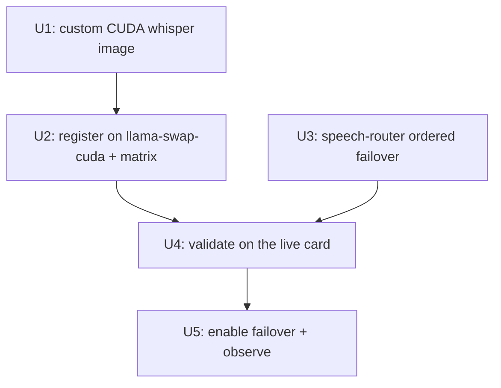

# feat: CUDA-node STT failover (hr-main) for speech-router

## Overview

WS1 put STT on rh-anine (Vulkan llama-swap) as the sole upstream. This fast-follow
adds **whisper.cpp on hr-main's `llama-swap-cuda`** as a *secondary* STT upstream so
STT survives an rh-anine outage — delivering the "use both nodes" goal as
**rh-anine-primary, CUDA-failover** (not load-balancing). It requires a custom CUDA
`whisper-server` image (none is published upstream), a careful addition to the tight
10 GiB chat-card VRAM matrix, and ordered failover in speech-router.

**This is redundancy, not a fix** — WS1 already resolved the production incident. Value
is failover for rh-anine (which had a now-"reportedly fixed" egress issue). It is
gated/optional and deliberately low-blast-radius: the CUDA card serves STT only when
rh-anine is unavailable.

## Problem Frame

speech-router's `STT_URLS` is currently a single rh-anine entry. If rh-anine (or its
llama-swap) is down, all STT fails (Bazarr `/asr`, HA Wyoming, OpenAI passthrough).
Adding a CUDA-node upstream gives a second source. The challenge is doing so without
(a) breaking the production chat models on the contended 10 GiB RTX 3080, (b) masking a
silently-broken CUDA node behind failover, or (c) an unmaintainable image.

## Requirements Trace

- **R1.** STT continues to work when rh-anine/llama-swap is unavailable (failover to CUDA).
- **R2.** Adding CUDA whisper must NOT break the existing chat/embedding models on the
  10 GiB card (no OOM, controlled eviction only during actual failover).
- **R3.** Failover must not silently mask a broken CUDA node — per-upstream observability;
  fail over only on real connection failures, not on llama-swap cold-load 503s.
- **R4.** The custom CUDA image is reproducible and provenance-tracked (pinned base +
  whisper.cpp commit).
- **R5.** rh-anine remains STT **primary**; CUDA is failover-only (no steady-state STT on
  the chat card).

## Scope Boundaries

- **Non-goal:** load-balancing STT across nodes — strict primary/failover order.
- **Non-goal:** moving transcription default off rh-anine, or changing TTS (Kokoro stays).
- **Non-goal:** pinning whisper resident on the CUDA card (it must be on-demand + short
  ttl so it frees VRAM back to chat after a failover window).
- **Non-goal:** the translate model on CUDA — translate stays rh-anine-only (rare; large-v3
  won't fit the tight card alongside chat).

## Context & Research (spike findings, 2026-06-02)

- **No upstream CUDA `whisper-server` image** — ggml-org publishes Vulkan/etc., no `cuda`
  tag. Must compile whisper.cpp `-DGGML_CUDA=ON`.
- **`llama-swap:cuda` ships CUDA 12.8 runtime** (`libcudart.so.12`, `/usr/local/cuda-12.8`),
  so compiling whisper.cpp against CUDA 12.x and COPYing `whisper-server` into
  `llama-swap:cuda@digest` links cleanly. Build needs the CUDA toolkit but **no GPU**, so
  it can build on rh-anine's docker (the existing `containers/` build host).
- **Validation requires deploying to the live card** — rh-anine is AMD; the only place to
  exercise a CUDA image is `llama-swap-cuda` on hr-main.
- **10 GiB matrix is tight** (from `llama-swap-cuda.yaml`): measured `jina(2)+gemma-e2b(4.7)=6.7 ✓`,
  `jina+GLM-4.6V(8)=OOM`. whisper ~2 GiB coexists with jina+gemma-e2b but **not** with GLM
  or gemma-e4b.
- hr-fleet build pattern: `containers/llama-server-turboquant/build.sh` builds via the
  rh-anine docker host and pushes to `registry.hr-home.xyz`.

## Key Technical Decisions

| Decision | Rationale |
|---|---|
| Custom image = multi-stage: build whisper.cpp CUDA 12.x → COPY `whisper-server` into `llama-swap:cuda@<digest>` | No upstream image; CUDA 12.8 runtime already present in the base; minimal layer. |
| Build on rh-anine docker, push to `registry.hr-home.xyz/kryptt/llama-swap-whisper-cuda` | Mirrors the existing `containers/` build pattern + creds. |
| whisper on CUDA is **on-demand, short ttl, mutually exclusive with chat** (coexists only with the pinned embedder) | Failover is rare; must not pin VRAM or OOM. Loading whisper evicts the chat tier for the failover window, then ttl frees it back. |
| rh-anine **primary**, CUDA **failover** (ordered `STT_URLS`) | CUDA card serves STT only on rh-anine outage (R5). |
| Fail over only on connect errors / non-loading 5xx; per-upstream metric | Don't treat a normal llama-swap cold-load 503 as "node down"; don't let failover hide a broken CUDA node (R3). |

## Open Questions

### Resolved During Planning
- Build approach, base/runtime match, build host → see Context.
- Primary/failover ordering → rh-anine primary.

### Deferred to Implementation
- ~~**Exact CUDA matrix set expression**~~ — RESOLVED (Unit 4): `main: "(j & (e | E)) | g | (j & w)"`.
  `nvidia-smi` confirmed jina+whisper=4583 MiB fits, gemma/GLM each evict whisper, no OOM.
- **whisper ttl on CUDA** — set to 600 s; frees the 2002 MiB back to chat after a failover window.
- **whisper.cpp commit + CUDA devel base tag** to pin.
- **Failover trigger predicate details** — which reqwest error kinds / HTTP statuses count
  as "try next" vs "loading, wait".

## Implementation Units

- [x] **Unit 1: Custom CUDA `whisper-server` image** — built+pushed `registry.hr-home.xyz/kryptt/llama-swap-whisper-cuda:v1.8.6` @ sha256:46175825…0296eb

**Goal:** Produce `registry.hr-home.xyz/kryptt/llama-swap-whisper-cuda:<ver>` = the stock
`llama-swap:cuda` plus a CUDA-built `whisper-server`.

**Files:** Create `containers/llama-swap-whisper-cuda/{Dockerfile,build.sh}` in hr-fleet.

**Approach:**
- Multi-stage: `FROM nvidia/cuda:12.8.x-devel AS build` → clone whisper.cpp (pinned commit),
  `cmake -DGGML_CUDA=ON`, build `whisper-server`. `FROM ghcr.io/mostlygeek/llama-swap:cuda@<digest>`
  → COPY the `whisper-server` binary (+ any whisper/ggml-cuda shared libs not already present;
  the base has `libcudart.so.12`/`libcublas`). Pin base `@sha256` and the whisper.cpp commit.
- `build.sh` mirrors `containers/llama-server-turboquant/build.sh` (build on rh-anine docker,
  version-check, push to `registry.hr-home.xyz`). Carry provenance per repo convention.

**Test scenarios:** Test expectation: none (image build). Validation = image builds; contains
`whisper-server`; `whisper-server --help` runs. (Real CUDA execution verified in Unit 4 — no
GPU at build time.)

**Verification:** image pushed + digest-pinned; `whisper-server` present.

- [x] **Unit 2: Register whisper on `llama-swap-cuda` + matrix strategy** — deployed (hr-fleet 1b295dc); model registered, pod healthy on the custom image, `ggml-large-v3-turbo.bin` provisioned to hr-main (sha matches rh-anine), NetworkPolicy admits speech-router.

**Goal:** Add a `whisper` model to the CUDA llama-swap, sized so it never breaks chat.

**Files:** Modify hr-fleet `fleet/ai/llama-swap-cuda.yaml` (image → Unit 1's; ConfigMap model +
matrix; NetworkPolicy admit speech-router).

**Approach:**
- Switch the Deployment image to the custom image (Unit 1).
- Add model `whisper` (alias) running `whisper-server -m /models/ggml-large-v3-turbo.bin
  --inference-path /v1/audio/transcriptions --language auto`, `checkEndpoint: /health`,
  short `ttl` (e.g. 600). Provision `ggml-large-v3-turbo.bin` to hr-main's
  `/swarm/main/ai/llama-server` (SHA-verified; same file as rh-anine).
- **Matrix:** whisper (~2 GiB) coexists only with the pinned embedder, mutually exclusive
  with the chat tiers. Candidate: vars add `w`; keep `evict_costs: {j: 50}` (do NOT pin w);
  set `main: "(j & (e | E)) | g | (j & w)"` — valid states: jina+gemma, GLM-solo, or
  **jina+whisper** (loading whisper for failover evicts the chat tier; ttl restores it).
  **Confirm the actual footprint with `nvidia-smi` in Unit 4 before relying on it.**
- NetworkPolicy `llama-swap-cuda-ingress`: add `app=speech-router` (currently ollama-router-only).

**Test scenarios:** Test expectation: none (declarative). Validation in Unit 4.

**Verification:** `kustomize build` renders; image swapped; matrix admits whisper without a
GLM/gemma+whisper OOM state.

- [x] **Unit 3: speech-router ordered STT failover** — done (0.5.0, commit 4054055). Transport-error-only failover across asr/wyoming/passthrough, per-upstream metric, body re-materialised per attempt. ce:review hardening: /health probes all upstreams (so a primary outage doesn't fail readiness & defeat failover); buffered paths fail over on mid-body transport errors. 65 tests, clippy+fmt clean.

**Goal:** Make speech-router try `STT_URLS` in order, failing over correctly.

**Files:** Modify `src/asr.rs` (failover loop; rebuild multipart per attempt), `src/wyoming.rs`
(clone wav bytes for retry), `src/metrics.rs` (+ per-upstream counter), `src/main.rs`
(passthrough failover); Test those.

**Approach:**
- Iterate `stt_upstreams` in order. **Per attempt, rebuild the `reqwest::multipart::Form` and
  reopen the temp file** (the body stream is single-use) — for `/asr` the `TempPath` persists;
  for Wyoming clone the wav `Vec` before the loop.
- **Trigger predicate:** fail over on connection errors (connect refused/timeout) and
  non-loading 5xx; do **not** fail over on a llama-swap cold-load 503 (treat as "wait", bounded
  by the existing request timeout). Confirm llama-swap's loading status shape in Unit 4.
- **Per-upstream metric:** counter labeled by upstream + outcome (served / fell-through /
  reason). A non-zero primary-fallthrough rate is the signal a node is broken (R3).
- Detection (`detect_language_*`) uses the primary; failover applies to the transcribe/translate calls.

**Test scenarios:**
- Happy: single healthy upstream → no failover.
- Failover: primary connection-refused → second upstream receives the **full** body and returns a transcript (assert body re-materialized, not empty).
- No-failover-on-loading: a 503 "loading" from primary does not trigger failover (waits).
- Metric: fell-through increments the per-upstream counter with reason.
- Edge: all upstreams fail → existing error shape; Wyoming empty-transcript fallback + its metric.

**Verification:** asr/wyoming/metrics tests pass; failover re-sends the body; loading-503 doesn't mis-trigger; per-upstream metric wired.

- [x] **Unit 4: Validate on the live CUDA card (gate before enabling)** — GO. Measured on the live RTX 3080 (10240 MiB): whisper-server runs **on the CUDA GPU** (2002 MiB; CPU build would use 0) and transcribed `jfk.wav` exactly; chat safety confirmed — gemma4:e2b solo (2780) evicts whisper cleanly; **jina+whisper failover steady state = 4583 MiB** (~5.6 GiB headroom); GLM-4.6V solo (7962) evicts whisper+jina; **zero OOM in any transition**. whisper cold-load health ~2.3s.

**Goal:** Confirm the CUDA image runs whisper on the GPU AND chat models are unharmed,
before speech-router is allowed to use the CUDA upstream.

**Approach (acceptance gate):**
- Deploy Units 1–2. Confirm `whisper-server` loads on the **NVIDIA GPU** (logs show CUDA
  device, not CPU) and `/upstream/whisper/v1/audio/transcriptions` returns a correct transcript
  via `llama-swap-cuda` (test like WS1 Unit 6, from the pod).
- **Chat safety:** with whisper loaded, exercise jina (embeddings), a gemma tier, and GLM —
  confirm each still loads/serves and the matrix evicts cleanly (no OOM in llama-swap-cuda logs).
- Measure CUDA whisper RTF + cold-load; confirm whisper's ttl frees VRAM back to chat after idle.

**Verification:** CUDA whisper transcribes on GPU; chat models unbroken; documented RTF + a
go/no-go before Unit 5.

- [x] **Unit 5: Enable failover + observe** — DONE. speech-router 0.5.0 then 0.5.1 deployed with
  `STT_URLS=rh-anine,cuda`. Two live drills (rh-anine `llama-swap` scaled to 0): **passthrough +
  Wyoming failed over to CUDA correctly**; steady state returns to rh-anine. Drill 1 **exposed** that
  `/asr` (Bazarr) did NOT fail over — language detection was primary-pinned and runs before the
  transcribe call → `language detection failed`. Fixed in **0.5.1** (`detect_language_with_failover`,
  commit 022fcba); drill 2 confirmed `/asr` now fails over end-to-end (detected `english`, full
  transcript via CUDA). Metric `…stt_upstream_attempts_total{outcome="fell_through"}` fired on rh-anine
  during outages. NOTE for drills: Fleet drift-correction reverts a manual `kubectl scale` — pause the
  GitRepo (`spec.paused=true`) for the outage window, then unpause.

**Goal:** Add the CUDA upstream to speech-router and verify real failover.

**Files:** Modify hr-fleet `fleet/ai/speech-router.yaml` (`STT_URLS=
"http://llama-swap.ai.svc:8080,http://llama-swap-cuda.ai.svc:8080"` — rh-anine first); ship the
Unit 3 speech-router image (version bump → release tag → CI).

**Approach:**
- Deploy. In steady state, all STT stays on rh-anine (confirm via the per-upstream metric:
  cuda fall-through ≈ 0).
- **Failover drill:** make rh-anine whisper unavailable (e.g. scale `llama-swap` to 0 briefly /
  off-hours), confirm STT continues via CUDA (Bazarr `/asr` + a Wyoming round-trip), then restore
  and confirm it returns to rh-anine.

**Verification:** steady-state STT on rh-anine; during a simulated rh-anine outage, STT served by
CUDA; chat on hr-main still works during that window; metric reflects the fall-through.

## System-Wide Impact

- **Chat models (hr-main):** the main blast radius — whisper loading evicts a chat tier during
  failover. Mitigated: on-demand + short ttl + matrix excludes the OOM states. Validated in Unit 4.
- **Failover masking:** per-upstream metric + connect-error-only trigger (R3).
- **Build/maintenance:** a new custom image to keep current with llama-swap:cuda + whisper.cpp
  (Renovate digest-pin; document the rebuild trigger).
- **Unchanged:** rh-anine primary path, TTS (Kokoro), Wyoming/Bazarr contracts.

## Risks & Dependencies

| Risk | Mitigation |
|------|------------|
| whisper on the 10 GiB card OOMs / breaks chat | Matrix excludes whisper+GLM/whisper+gemma-e4b; on-demand + ttl; Unit 4 measures real footprint before enabling. |
| Failover masks a broken CUDA node | Per-upstream fall-through metric + alert; connect-error-only trigger. |
| Failover sends an empty body (single-use multipart stream) | Rebuild Form + reopen temp file / clone wav per attempt; test asserts the 2nd upstream gets the full body. |
| Cold-load 503 mis-triggers failover | Trigger predicate distinguishes loading from down; confirmed in Unit 4. |
| Custom CUDA image drift / maintenance | Pin base@digest + whisper.cpp commit; provenance; document rebuild. |
| Validation only possible on the prod card | Unit 4 is an explicit gate; test off-hours; chat-safety checks before Unit 5 enables it. |

## Phased Delivery

1. **Image** (Unit 1) — self-contained, no prod impact.
2. **Register + validate** (Units 2, 4) — deploys to the card but speech-router does NOT use it
   yet; gate on chat-safety + CUDA-whisper working.
3. **Failover code** (Unit 3) — speech-router, behind the ordered list (inert until Unit 5 adds
   the second URL).
4. **Enable** (Unit 5) — add the CUDA upstream + failover drill.

## Sources & References

- Origin: `docs/plans/2026-06-02-001-…-plan.md` ("Fast-Follow (Deferred)").
- Spike (this session): CUDA 12.8 match; no upstream CUDA whisper image; 10 GiB co-residence numbers.
- hr-fleet: `fleet/ai/llama-swap-cuda.yaml`, `containers/llama-server-turboquant/`.
- speech-router: `src/asr.rs`, `src/wyoming.rs`, `src/main.rs`, `src/config.rs` (STT_URLS already a list).
