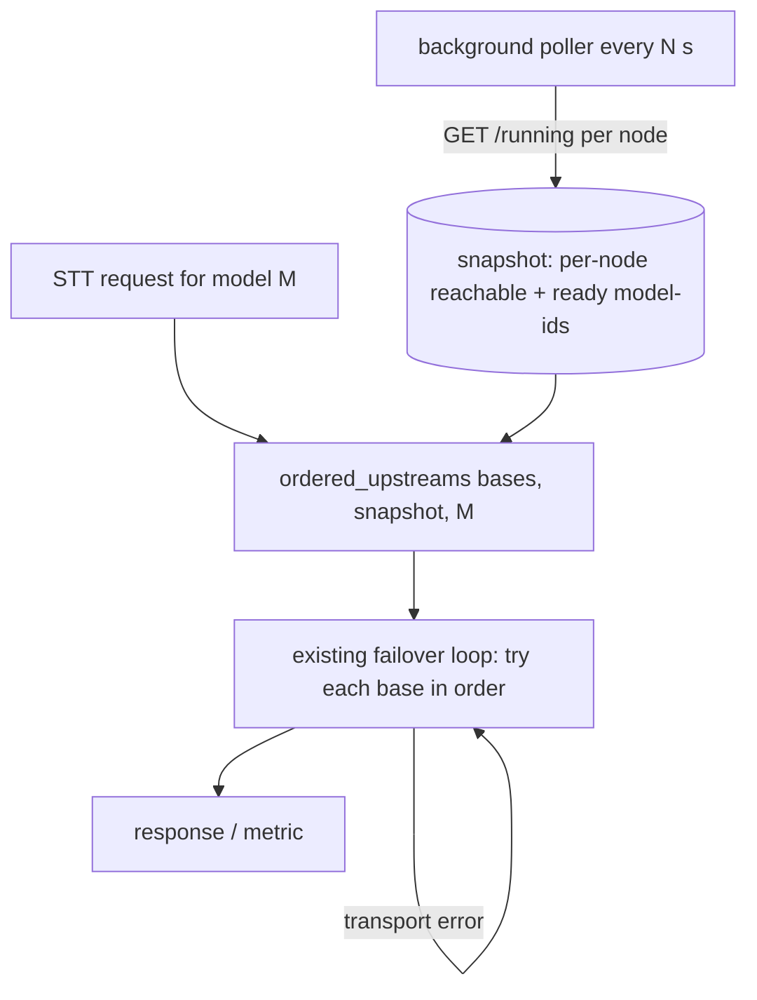
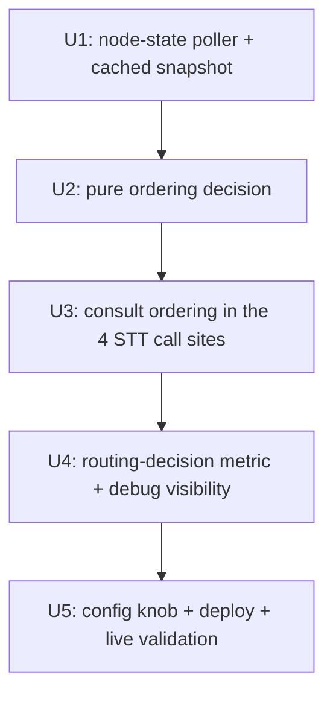

# feat: model-state-aware STT routing for speech-router

## Overview

speech-router currently routes STT to `STT_URLS` in **strict order** (rh-anine Vulkan
primary → hr-main CUDA failover) and only advances to the next upstream when the request
throws a transport error (`is_transport_failure` = `reqwest::is_connect() || is_timeout()`,
`src/proxy.rs`). It has **no awareness** of either node's state: it will send a request into
a known-down primary (paying the connect timeout per request before failing over), and it
can't take advantage of an already-warm failover.

This plan adds a lightweight **node-state layer**: a background task polls each llama-swap
node's `/running` endpoint (a live "ps" of loaded models with per-model `state`), caches the
result, and a pure decision function **reorders** the upstream list per request based on that
state. The existing ordered-failover loop is unchanged underneath — state only chooses the
*starting order*, so the proven transport-failover remains the correctness floor and the worst
case is exactly today's behavior.

Policy (chosen during planning): **smart primary-preference** — always prefer rh-anine; use
state to skip a down primary or ride a warm failover; **never** push steady-state load onto the
contended CUDA chat card. This is not load-balancing.

## Problem Frame

Two consumers feel the gap today:
- **Home Assistant voice** during an rh-anine `llama-swap` restart/deploy: whisper is briefly
  `loading` or the node is unreachable; requests currently wait on a cold-load or pay a
  connect-timeout-then-failover on *every* utterance until the primary recovers.
- **Any STT** during a real rh-anine outage: failover works (proven in plan 003 drills) but is
  *reactive* — each request first attempts the dead primary. If the primary black-holes (drops
  packets) rather than refusing, that's up to a 10 s `connect_timeout` per request.

The opportunity is concrete and already verified: llama-swap's `/running` returns, per node, the
loaded models and their `state` (`ready` / `loading`), so speech-router can route on real warmth
instead of a blind static order.

## Requirements Trace

- **R1.** Routing prefers the primary (rh-anine) in steady state; the CUDA card never takes
  steady-state STT load (respect node asymmetry).
- **R2.** When the primary's target model is **not ready** (loading/cold/down) **and** a failover
  node has it **ready**, route to the warm failover first (latency win, no extra VRAM cost).
- **R3.** When the last poll shows the primary **unreachable**, route to a reachable failover
  first — skip the per-request connect wait on a known-down node.
- **R4.** When neither node has the model ready but the primary is reachable, keep primary-first
  (let the primary cold-load; do **not** cold-load the contended CUDA card just because the
  primary is briefly loading).
- **R5.** The existing transport-error failover remains the floor: the request loop still iterates
  *all* upstreams in the chosen order, so a wrong/stale hint degrades to today's behavior, never to
  an error. No regression to the plan-003 failover or the 0.5.1 detection-failover.
- **R6.** State polling adds **zero latency to the request path** (cached; background refresh) and
  is fail-safe: a polling failure degrades routing to the static ordered list, never blocks STT.
- **R7.** Routing decisions are observable (metric) so the asymmetry policy and any reordering can
  be verified in production.

## Scope Boundaries

- **Non-goal:** active load distribution / round-robin / least-loaded across nodes (explicitly
  rejected — the CUDA card is contended with chat; STT volume is low; primary handles it).
- **Non-goal:** a configurable multi-policy engine. Policy is fixed to primary-preference (one
  on/off + poll-interval knob only).
- **Non-goal:** changing TTS (Kokoro) routing, the Wyoming/Bazarr/OpenAI contracts, or the
  llama-swap matrices.
- **Non-goal:** GPU/VRAM telemetry-based routing (nvidia-smi). `/running` model-state is the only
  signal; richer telemetry is a possible future extension, not this plan.
- **Non-goal:** reacting to `/running` `loading` by *proactively* cold-loading the failover (R4
  deliberately waits on the primary instead).

## Context & Research

### Relevant Code and Patterns

- `src/proxy.rs` — `is_transport_failure()` (failover trigger), `try_forward()` (send that surfaces
  the transport error). The new decision layer sits *above* this; it does not change the predicate.
- `src/asr.rs` — `send_with_failover()` and `detect_language_with_failover()` both iterate
  `stt_bases: &[String]`. These are the consumers that need the *reordered* list. `AsrState`
  already carries `stt_upstreams`, `client`, `metrics` — add the shared node-state handle here.
- `src/wyoming.rs` — `finish_stt()` iterates `config.stt_upstreams`. Same reorder seam.
- `src/main.rs` — `passthrough_transcriptions()` iterates `state.config.stt_upstreams`; `AppState`
  holds `config`/`client`/`metrics`/`registry`; `main()` already spawns a background task
  (`wyoming::serve`) — mirror that to spawn the poller.
- `src/metrics.rs` — `Family<Vec<(String,String)>, Counter>` pattern + `stt_upstream_labels()`
  helper to mirror for the routing-decision metric.
- `src/config.rs` — env parsing with defaults; add the poll-interval/enable knob here.

### Verified `/running` contract (live, 2026-06-02)

`GET {base}/running` → `{"running":[{"model":"whisper-large-v3-turbo","state":"ready",
"proxy":"http://localhost:18004","ttl":600,...}, ...]}`. Observed states include `ready`. A node
that is up but has nothing loaded returns an empty `running` array; an unreachable node fails the
GET (→ treat as unreachable). NetworkPolicy already admits speech-router to both
`llama-swap.ai:8080` and `llama-swap-cuda.ai:8080` (plan 003), so `/running` is reachable on both.

### Warm/cold reality (drives how often reordering actually fires)

| Model | rh-anine (primary) | hr-main (failover) |
|---|---|---|
| whisper (`w`) | **always ready** (pinned, ttl -1, preloaded) | cold/on-demand (ttl 600) |
| whisper-translate (`wt`) | cold/on-demand (unpinned as of 2026-06-02) | cold/on-demand (ttl 600) |

So for **transcribe**, the primary is essentially always ready → reordering mainly matters during
a primary restart/outage (R2/R3). For **translate**, both are usually cold → primary-first
cold-load (R4) unless one is already warm. The win is real but targeted; the design must stay
cheap and never regress (R5/R6).

### Institutional Learnings

- `docs/plans/2026-06-02-003-…` + the project memory: failover is transport-error-only; `/asr`
  runs detection *before* transcription (both must use the same reordered list); `/health` must
  stay all-upstreams (don't reintroduce primary-only gating); Fleet reverts manual `kubectl scale`
  (pause GitRepo for drills); release = semver tag push.
- **Alias gotcha:** `/running` reports the *canonical* model id (`whisper-large-v3-turbo`), but
  speech-router requests the *alias* (`whisper`). Warmth matching must resolve this (see Key
  Decisions) — and must be **safe under ambiguity** (unknown → no reorder).

## Key Technical Decisions

| Decision | Rationale |
|---|---|
| **Background poller + cached snapshot**, request path reads the cache (no network on the hot path) | R6: zero added request latency; a 5 s-stale hint is fine because the transport-failover floor catches anything stale. |
| Reorder is a **hint over the existing ordered-failover loop** (choose starting order; still iterate all bases) | R5: worst case = today's behavior; no new failure modes; tiny blast radius. |
| **Pure decision function** `ordered_upstreams(bases, states, model)` | Exhaustively unit-testable without network; the heart of the feature; test-first. |
| **Don't cold-load CUDA on a *mere* primary `loading`** — only reorder to failover when failover is already `ready` (R2) or primary is unreachable (R3) | Respects asymmetry (R1/R4): a transient primary cold-load shouldn't steal chat VRAM. |
| **Best-effort warmth match, ambiguity → no reorder** | Alias↔canonical mapping isn't always knowable; a positive "ready" match enables the optimization, anything uncertain falls back to safe primary-first order. |
| **`arc-swap` for the shared snapshot** (read-mostly, lock-free reads) | Avoids holding a lock across `.await` on the request path; clean for a hot read / periodic write. (Alternative: `std::sync::RwLock` with a short non-await read — acceptable if avoiding the dep is preferred; decide at impl.) |
| **On/off + interval knob only** (no policy engine) | Scope boundary: one fixed policy; `STATE_POLL_INTERVAL_SECS=0` disables → pure static ordering (instant escape hatch / rollback without redeploy of code). |

## High-Level Technical Design

> *Directional guidance for review, not implementation specification.*

**Decision matrix** — for a request needing model `M`, given the cached snapshot (per node: reachable?, is `M` ready?). "primary" = first entry of `STT_URLS`, "failover" = the rest in order:

| Primary state (for M) | A failover with M `ready`? | Chosen order | Decision label |
|---|---|---|---|
| ready | — | [primary, …failover] | `primary_ready` |
| not ready, reachable | yes | [warm-failover, primary, …] | `failover_warm` |
| not ready, reachable | no | [primary, …failover] | `primary_cold` (let primary load; R4) |
| unreachable | yes/any reachable | [reachable-failover…, primary] | `primary_down` |
| unreachable | none reachable | [primary, …failover] | `all_unreachable` (loop surfaces the error) |

**Flow:**

The poller and the request path share only the immutable snapshot; the loop in `send_with_failover`
/ `finish_stt` / `passthrough_transcriptions` / `detect_language_with_failover` is unchanged except
its input list is now `ordered_upstreams(...)` instead of the raw config order.

## Open Questions

### Resolved During Planning
- **Routing policy** → smart primary-preference (user decision); not load-balancing.
- **Polling mechanism** → background task + cached snapshot (on-request polling rejected: violates R6).
- **`loading` handling** → wait on the primary (R4) unless a failover is already `ready` (R2); do
  not proactively cold-load CUDA.

### Deferred to Implementation
- **Exact `/running` `state` enum** beyond `ready` (e.g. `loading`, `stopping`) — verify against the
  live instances; the decision logic only needs "is M `ready`?" so unknown states are treated as
  not-ready (safe). Confirm during Unit 1.
- **Alias→canonical resolution mechanism** — options: a small config map, matching the `cmd`/model
  file in the `/running` entry, or treating the configured `STT_MODEL` as canonical. Pick the
  simplest that yields a positive `ready` match for `whisper`/`whisper-translate`; ambiguity → no
  reorder. Decide against the real `/running` payloads in Unit 1/2.
- **Poll interval default** (start at 5 s; tune against staleness vs load on `/running`).
- **`arc-swap` vs `RwLock`** — confirm at impl (dep already-present check).

## Implementation Units

- [x] **Unit 1: Node-state poller + cached snapshot**

**Goal:** A background task that polls each STT upstream's `/running` on an interval and publishes
an immutable per-node snapshot (reachable + set of `ready` model ids).

**Requirements:** R6 (fail-safe, off the hot path), foundation for R1–R4.

**Dependencies:** none.

**Files:**
- Create: `src/node_state.rs` (snapshot types, parser, poller task)
- Modify: `src/config.rs` (poll-interval/enable), `src/main.rs` (spawn the task, build the shared handle)
- Modify: `Cargo.toml` (only if `arc-swap` is chosen)
- Test: `src/node_state.rs` `#[cfg(test)]`

**Approach:**
- `NodeSnapshot { reachable: bool, ready_models: HashSet<String> }`; `NodeStates` = map base→snapshot.
- Poller: every interval, `GET {base}/running` (short timeout, e.g. 3 s) per base; parse `running[]`,
  collect entries with `state == "ready"` into `ready_models`; poll error → `reachable: false`.
  Publish into the shared handle (`arc-swap` swap, or `RwLock` write).
- Interval `0` → don't spawn the task; snapshot stays empty (ordering degrades to static).
- Parsing tolerates unknown fields and unknown `state` values (treat non-`ready` as not-ready).

**Patterns to follow:** the background-task spawn in `main.rs` (`wyoming::serve`); reqwest client
reuse (`state.client`); tolerant `serde_json::Value` parsing as in `asr.rs`.

**Test scenarios:**
- Happy: `/running` JSON with two `ready` models → snapshot lists both ids, `reachable: true`.
- Edge: empty `running` array → `reachable: true`, no ready models.
- Edge: entry with `state: "loading"` (or unknown) → not in `ready_models`.
- Error: poll request errors → snapshot `reachable: false`, `ready_models` empty.
- Edge: interval 0 → poller not spawned (no-op snapshot).

**Verification:** snapshot parser unit tests pass; against the live cluster the snapshot reflects
both nodes' loaded models within one interval.

- [x] **Unit 2: Pure ordering decision**

**Goal:** `ordered_upstreams(stt_bases, &NodeStates, requested_model) -> Vec<String>` implementing
the decision matrix.

**Requirements:** R1, R2, R3, R4, R5.

**Dependencies:** Unit 1 (snapshot types).

**Files:**
- Modify/Create: `src/node_state.rs` (or `src/routing.rs`) — the pure function + decision enum
- Test: same file `#[cfg(test)]`

**Approach:**
- Implement the matrix above. Returns a permutation of `stt_bases` (never drops an entry — R5).
- Emits a `RoutingDecision` label (for Unit 4) alongside the order.
- Warmth check uses best-effort alias resolution (Open Question); unknown warmth → treat primary
  as the safe default (no reorder).

**Execution note:** test-first — this pure function is the core correctness surface.

**Test scenarios:**
- Happy/R1: primary ready → order unchanged `[primary, failover]`, label `primary_ready`.
- R2: primary not-ready (reachable) + failover ready → `[failover, primary]`, label `failover_warm`.
- R4: primary not-ready (reachable) + failover not-ready → `[primary, failover]`, label `primary_cold`.
- R3: primary unreachable + failover reachable → `[failover, primary]`, label `primary_down`.
- Edge: all unreachable → `[primary, failover]` (unchanged), label `all_unreachable`.
- Edge: empty snapshot (poller disabled) → static order unchanged for every model.
- Edge/R5: result is always a permutation containing every input base (property check).
- 3-upstream sanity (future-proofing): warm node hoisted, others keep relative order.

**Verification:** every matrix row has a passing test; a property test confirms the output is a
permutation of the input.

- [x] **Unit 3: Consult ordering in the STT call sites**

**Goal:** Route each STT path through `ordered_upstreams(...)` instead of the raw config order.

**Requirements:** R5 (no regression), applies R1–R4 to real traffic.

**Dependencies:** Unit 2.

**Files:**
- Modify: `src/asr.rs` (`send_with_failover`, `detect_language_with_failover` — both must use the
  *same* reordered list so detection and transcription agree), `AsrState` (+snapshot handle)
- Modify: `src/wyoming.rs` (`finish_stt`)
- Modify: `src/main.rs` (`passthrough_transcriptions`; `AppState`/`AsrState` construction; thread
  the snapshot handle into `wyoming::serve` and `AsrState`)
- Test: `src/asr.rs`, `src/wyoming.rs`, `src/main.rs` failover test modules (extend existing mocks)

**Approach:**
- At the top of each loop, compute `let order = ordered_upstreams(bases, &snapshot, model);` and
  iterate `order`. The loop body (rebuild form / clone wav / clone Bytes, transport-failover,
  per-upstream metric) is unchanged.
- Detection and transcription in `/asr` must use the same model's order (detection uses the STT
  model; transcription may use the translate model — order computed per the model actually requested).

**Patterns to follow:** the existing failover loops + their `failover_tests` mock-server harness
(spawn mock + closed-addr) — assert *which* upstream is hit first.

**Test scenarios:**
- R2 (asr): snapshot = primary not-ready, failover ready → mock on the failover receives the request
  first (assert hit order), primary not contacted; full body re-materialised.
- R1 (asr): primary ready → primary hit first (current behavior).
- R3 (wyoming): primary unreachable in snapshot → finish_stt hits failover first (no primary
  connect attempt), returns transcript.
- R5 (all paths): stale/empty snapshot → behaves exactly as today (primary-first, transport-failover).
- passthrough: same reorder honored on `/v1/audio/transcriptions`.

**Verification:** path tests assert first-contacted upstream matches the snapshot-driven order;
existing plan-003/0.5.1 failover + detection-failover tests still pass unchanged.

- [x] **Unit 4: Routing-decision metric + debug visibility**

**Goal:** Make routing decisions observable.

**Requirements:** R7.

**Dependencies:** Unit 3.

**Files:**
- Modify: `src/metrics.rs` (`stt_routing_decisions_total{decision}` counter + label helper)
- Modify: the STT call sites (increment with the `RoutingDecision` label from Unit 2)
- Optional: `src/main.rs` `/health` body or a small `/debug/upstreams` to dump the snapshot
- Test: `src/metrics.rs`

**Approach:**
- Counter labeled by `decision` (`primary_ready` | `failover_warm` | `primary_cold` |
  `primary_down` | `all_unreachable`). A non-zero `failover_warm`/`primary_down` rate is the signal
  that state-aware routing is doing something.
- Keep cardinality fixed (5 labels); reuse the `Family`/label-helper pattern.

**Test scenarios:**
- Each decision label increments its series when that branch is taken (drive via Unit 2 + a path test).
- Encode output contains `speech_router_stt_routing_decisions_total`.

**Verification:** metrics test passes; the decision counter is visible on `/metrics`.

- [x] **Unit 5: Config knob, deploy, and live validation**
  <!-- Code shipped: STATE_POLL_INTERVAL_SECS (default 5, 0 disables) + tests,
       version → 0.6.0. Fleet image bump + controlled-restart drill + the
       interval=0 fallback check are operational, post-merge steps on the
       cluster (separate hr-fleet repo). -->

**Goal:** Ship behind a knob and validate on the cluster.

**Requirements:** R6 (escape hatch), R1–R3, R7.

**Dependencies:** Units 1–4.

**Files:**
- Modify: `src/config.rs` (`STATE_POLL_INTERVAL_SECS`, default 5; `0` disables), `Cargo.toml`
  (version → 0.6.0)
- Modify (hr-fleet): `fleet/ai/speech-router.yaml` (add the env; default on)
- Test: `src/config.rs` (parse/default/disable)

**Approach:**
- Release via semver tag (CI → GHCR), bump `speech-router.yaml` image, deploy via Fleet.
- Validate: (a) poller reads both nodes' `/running` (check `/metrics` decisions in steady state are
  `primary_ready`); (b) during an rh-anine `llama-swap` restart (pause GitRepo + restart, per the
  003 drill method), confirm requests route per policy — `primary_down`/`failover_warm` decisions
  appear and STT keeps working; (c) flip `STATE_POLL_INTERVAL_SECS=0` and confirm clean fallback to
  static ordering.

**Test scenarios:**
- Config: default interval present; `0` → disabled flag; invalid → error or safe default.

**Verification:** steady-state decisions are `primary_ready`; a controlled primary restart shows the
expected decision labels with STT continuity; disable knob cleanly reverts to static routing.

## System-Wide Impact

- **Interaction graph:** new background task (poller) + shared read-mostly snapshot consumed by the
  3 STT request paths and the detection helper. No change to TTS, Wyoming protocol, or HTTP contracts.
- **Error propagation:** poller failures are isolated — they only mark a node unreachable in the
  snapshot; they never surface to a request. The request path's transport-failover is unchanged.
- **State lifecycle risks:** the snapshot is the only shared mutable state; it's immutable-on-read
  (swap/clone), so no torn reads. Staleness bounded by the interval; correctness floored by failover.
- **API surface parity:** the reorder seam is applied to ALL four STT entry points (asr transcribe,
  asr detection, wyoming, passthrough) so behavior is consistent — a miss on any one would make that
  consumer behave differently under a primary outage.
- **Unchanged invariants:** `STT_URLS` config order is still the default/tiebreak; `is_transport_failure`
  predicate, the per-upstream `served`/`fell_through` metric, `/health` all-upstreams probing, and the
  0.5.1 detection-failover all unchanged. CUDA never takes steady-state load.

## Risks & Dependencies

| Risk | Mitigation |
|------|------------|
| Stale snapshot routes to a node that just changed state | Transport-failover floor (R5) re-routes within the request; staleness bounded by a short interval. |
| Alias↔canonical mismatch → warmth never detected → optimization silently no-ops | Best-effort match + explicit Unit-1/2 verification against live `/running`; ambiguity is *safe* (primary-first), only loses the optimization. |
| Poller adds load to `/running` on both nodes | Cheap endpoint (no model load); 5 s interval; single in-flight GET per node with a short timeout. |
| Reorder accidentally sends steady-state load to the CUDA card | R4 forbids reordering on mere primary `loading`; reorder only on failover-already-warm or primary-down; covered by Unit 2 tests + Unit 5 steady-state check (`primary_ready` dominates). |
| Added concurrency/complexity in a proven proxy | Knob (`interval=0`) disables the whole layer without a code rollback; pure decision fn is exhaustively tested; loop semantics untouched. |
| llama-swap `/running` schema changes across versions | Tolerant parsing (unknown fields/states ignored); pinned llama-swap image digests; verify in Unit 1. |

## Documentation / Operational Notes

- Document the new env (`STATE_POLL_INTERVAL_SECS`) and the `stt_routing_decisions_total` metric in
  the speech-router README / the open-webui-speech runbook's monitoring section.
- Update the project memory once live: state-aware routing is additive over transport-failover; the
  `interval=0` kill-switch; the alias-matching gotcha.

## Sources & References

- **Origin:** `docs/plans/2026-06-02-003-feat-cuda-node-stt-failover-plan.md` (failover now live, 0.5.1).
- Live `/running` payload captured 2026-06-02 (this session) — `state: ready`, per-model `ttl`/`proxy`.
- Code seams: `src/proxy.rs` (`is_transport_failure`, `try_forward`), `src/asr.rs`
  (`send_with_failover`, `detect_language_with_failover`), `src/wyoming.rs` (`finish_stt`),
  `src/main.rs` (`passthrough_transcriptions`, background-task spawn), `src/metrics.rs`.
